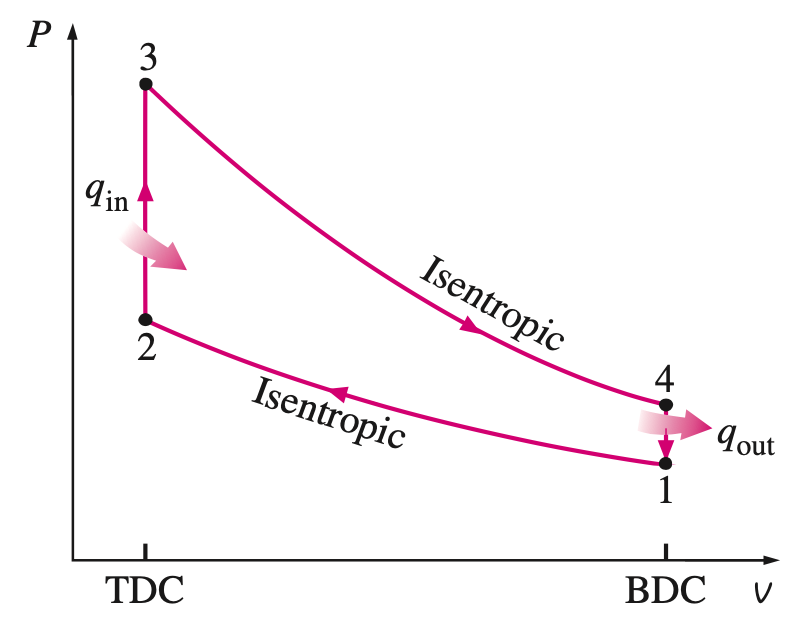
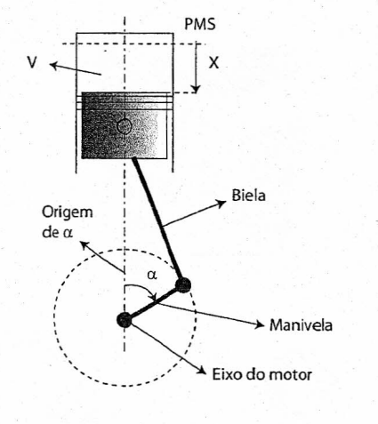
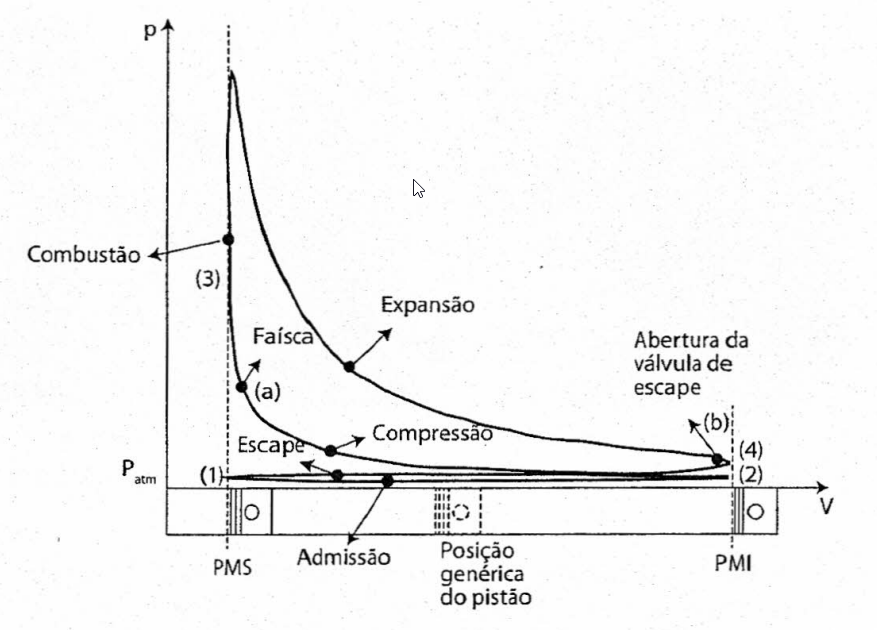
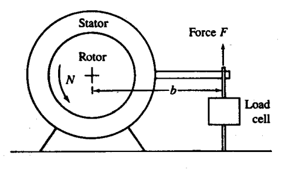
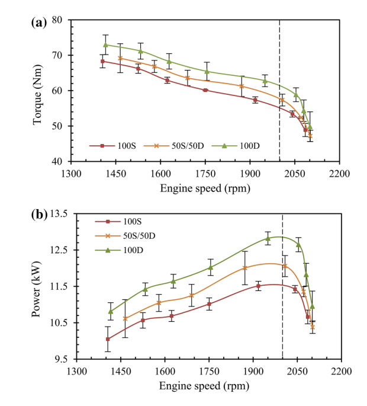

```{r setup, include=FALSE}
knitr::opts_chunk$set(echo = FALSE)
```

## Ciclos ideais {.flexbox .vcenter}

{ width=500px }

## Ciclos medidos

<div class="columns-2">
  { height=300px }

  - $L$ =  comprimento da biela 
  - $r$ = comprimento da manivela

</div>

  $$
  x = r (1 - \cos \alpha) + L \left(1 - \sqrt{1 - \left(\frac{r}{L}\right)^2 \sin^2 \alpha}\right)
  $$
  
  $$
  V = V_2 + x \frac{\pi}{4}D^2
  $$

## Diagrama real {.flexbox .vcenter}

{width=750px }

## Diagrama real {.flexbox .vcenter}

<div class="columns-2">
{ width=500px }

  > - $W_{\mathrm{i}} = \oint P \mathrm{d}\mathcal{V}$ 
  > - $\dot{W}_{\mathrm{i}} = W _{\mathrm{i}}\frac{N}{n _{\mathrm{R}}}$

</div>

## Torque e potência efetiva


{ width=600px }

> - $T = Fb$
> - $\dot{W}_{\mathrm{e}} = 2\pi T N$


---

]{ scale=0.5 }

## Atrito e eficiência mecânica {.flexbox .vcenter}

- *atrito*: mas toda forma de perda mecânica

$$
\dot{W} _{\mathrm{a}} = \dot{W} _{\mathrm{i}} - \dot{W} _{\mathrm{e}}
$$

$$
\eta_{\mathrm{m}} = \frac{\dot{W} _{\mathrm{e}}}{\dot{W} _{\mathrm{i}}}
$$

## Pressão média indicada {.flexbox .vcenter}

$$
W_{\mathrm{i}} = \oint P \mathrm{d}\mathcal{V} = \mathrm{PMI} \ \mathcal{V}_{\mathrm{D}}
$$

## Pressão média efetiva {.flexbox .vcenter}


$$
\mathrm{PME} = \frac{\dot{W} _{\mathrm{e}}}{\frac{N}{n _{\mathrm{R}}} \mathcal{V} _{\mathrm{D}}}
$$

|Tipo de motor|Valor típico de PME [kPa]| 
|-------------|-------------------------| 
| MIF NA | 1050 | 
| MIF TA | 1700 |
| MIE NA | 900  |
| MIE TA | 1200 |


## Consumo de combustível {.flexbox .vcenter}

Para funcionar e gerar uma potência efetiva $\dot{W}_{\mathrm{e}}$, em uma determinada rotação $N$ e com um determinado nível de aceleração, o motor consome uma vazão de ar $\dot{m}_{\mathrm{a}}$ e de combustível $\dot{m}_{\mathrm{c}}$. 

## Fração combustível-ar {.flexbox .vcenter}

$$
F = \frac{\dot{m} _{\mathrm{c}}}{\dot{m} _{\mathrm{a}}}
$$
$$
r = \frac{1}{F}
$$

|Tipo de combustível|Faixa para $r$| 
|-------------|-------------------------| 
| Gasolina | 12-18 | 
| Diesel | 18-70 |

## Consumos específicos

$$
\dot{C} _{\mathrm{a}}  = \frac{\dot{m} _{\mathrm{a}}}{\dot{W} _{\mathrm{e}}}
$$

$$
\dot{C} _{\mathrm{c}}  = \frac{\dot{m} _{\mathrm{c}}}{\dot{W} _{\mathrm{e}}}
$$

|Tipo de motor|$\dot{C} _{\mathrm{c}}$ [g/kWh]| 
|-------------|-------------------------| 
| MIF | 270 | 
| MIE | 200 |


## Eficiência global {.flexbox .vcenter}

$$
\eta _{\mathrm{g}} = \frac{\dot{W} _{\mathrm{e}}}{\dot{m} _{\mathrm{c}}\mathrm{PCI}}
$$

## Eficiência volumétrica {.flexbox .vcenter}

$$
\eta _{\mathrm{v}} = \frac{\dot{m}   _{\mathrm{a}}}{\rho _{\mathrm{a,i}} \mathcal{V}  _{\mathrm{D}}\frac{N}{2}}
$$


## Desafio 

1. Encontre uma expressão para a PME como função de eficiência global, eficiência volumétrica, poder calorífico, razão combustível-ar e densidade do ar na admissão e explique por quê a PME de MIE é menor que MIF. O que isso significa?

