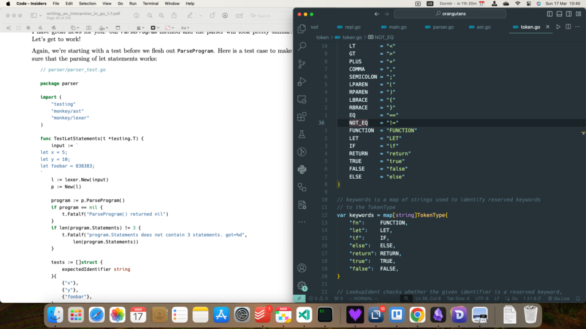

I think there is no better way to start this blog about being obsessed with programming: an explanation (mostly for myself) on why I'm studying interpreters (when I do not develop anything related to that) implemented in Go (a language I do not use professionally).

## Why this subject?

The first time I realized that studying interpreters and compilers is somethink I'd like to do was when re-reading _[The Pragmatic Programmer](https://a.co/d/bhoo1FD)_ last year. I first read this book almost 10 years ago, when I was graduating college and started working more and more with programming, first in my internship and then in my Master's studies. I remember it "being OK", without much resonance; however, now that I'm primarily a software developer, I thought it was time for a review.

_The Pragmatic Programmer_ starts with a list of tips that are obvious to me: be professional, care about your work, focus on quality, make learning a habit. The first tip that actually sounded as something new and noteworthy (at least for me, someone who doesn't have a degree in Computer Science or anything related) was the **importance of developing your own domain specific languages** **(DSL)**: think about common and repetitive tasks you have to do, encode how you would describe them in a dedicated language, and then create a program that will evaluate this language.

As it turns out, I do have lots of tasks that could use a specific language. In my daily work, I deal with JSON files that follow a specific configuration (describing inputs and outputs to simulations) that very often trigger the same sort of analysis. A DSL for my line of work would look like this:

```
for results in list_of_results:
    plot temperature vs position
    plot pressure vs position
    calculate maximum pressure

plot maximum pressure of each result vs initial pressure of each result
```

This actually would be useful! In addition, those very JSON files need to be parsed and validated - they also need to be _interpreted_ in a way.

## The book

In the beginning of this year, then, I decided to give _[Writing an Interpreter in Go](https://interpreterbook.com/)_ a try, inspired by this video (which made me also learn OCaml just because, but that's a story for another time).

https://www.youtube.com/watch?v=NjKJ9-ejR6o

I'm still on the second chapter, but I'm loving it. The book is well written, didactic without assuming the reader is stupid. It doesn't require the reader know a lot of Go, and it doesn't waste time explaning the syntax either - I can always just look it up.

This is a book for software developers, and the author assumes software developer can learn details of programming languages. Most importantly, **it's a book about software development**: thinking about data structures, developing incremental tests for their behaviour, not being afraid of creating functions that have just one line of code if they make understanding the program much easier, organizing the code into separate modules. All of these are useful things that I always to improve in my job.



## What I'm applying in my daily work as a Python developer

My main project at work is a simulator that was originally written by another very talented engineer, and that I now have to maintain and extend. Very often we and our clients deal with problems when reading and parsing the input files: some fields are missing or they are too complex. Inspired by these studies, I'm becoming less and less afraid of creating small data structures and functions that process one small part at a time - instead of just trying to conform to what is already in the code.

Yes, I develop Python application, but the language is just a detail. The book could be re-written in Python and the ideas, the theory, the methods would be the same. If I re-implemented my main project in Go (which I actually dream of, to get all the static cross-compilation benefits), my clients couldn't care less - they want simulation results. I'm a firmly believer of being programming languages polyglot and being able to study books that show code in different languages.

I'll have more to say when I advance in the book and use more and more of its ideas in my Python projects. In the meanwhile, give _Writing an Interpreter in Go_... a go.
