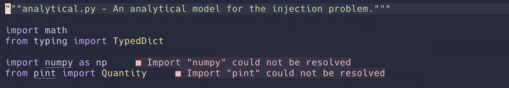

## The problem

If you are a nerd like me, you probably have joined the [Neovim](https://neovim.io/) cult and have spent more hours configuring it than you care to admit.

Then you might also have spent [digging around Python project managers](https://alpopkes.com/posts/python/packaging_tools/) and settled on using [Hatch](https://hatch.pypa.io/latest/) for one of your projects. In principle, this means you do not have to manually create environments. [You define dependencies in `pyproject.toml`](https://hatch.pypa.io/latest/environment/#dependencies) and, when executing [Hatch scripts](https://hatch.pypa.io/latest/config/environment/overview/#scripts), the `hatch` program will create environments, install dependencies and execute the commands (like running tests, linting, formatting etc) _inside_ those environments.

But now, when you write Python code on Neovim, using the standard [pyright](https://github.com/microsoft/pyright) as the language server (I use the [Python-ruff pack](https://github.com/AstroNvim/astrocommunity/tree/main/lua/astrocommunity/pack/python-ruff) from the [AstroNvim](https://astronvim.com/) communtity), if you use the same packages you define in the dependencies section (and which are not installed in your global Python environment), pright will complain that it cannot find packages:



How can it not find packages when you declared everything in the `pyproject.toml` file, and everything is supposed to be downloaded and installed automatically?

## The solution

**You need to tell pyright where to find environments in which the packages are installed**; then, pyright will recognized installed Python packages as something you can import from. In other words: pyright needs to be aware of your Hatch environments.

It might help to first configure hatch itself to use a directory for the virtual environments that are easy to find. **I like to use a `.hatch` subfolder in my project root folder** (don't forget to exclude it from source control). You can change the global hatch configuration to always use that location when using the `hatch` command with this shell commands:

ShellSession

```
hatch env prune # delete previously created environments
hatch config set dirs.env.virtual ".hatch" # modify configuration
```

Now, when you run a hatch command, it will create environments under `.hatch`.

Now you have to configure pyright in your `pyproject.toml` file. Suppose you define a `dev` environment in which to run various checks like this:

TOML

```
# pyproject.toml

[tool.hatch.envs.dev]
python = "3.11"

dependencies = ["mypy>=1.0.0", "pytest", "ruff"]

[tool.hatch.envs.dev.scripts]
check = [
  "pytest -xvv --ff",
  "ruff format .",
  "ruff check .",
]
```

This way, you can also create a environment, install your package and run all tests with:

ShellSession

```
hatch run dev:check
```

Now, include the following configuration:

TOML

```
# pyproject.toml

[tool.pyright]
executionEnvironments = [{ root = "src" }]
venvPath = ".hatch"
venv = "dev"
```

Restart your neovim, and you will see that the messages above disappear: pyright will get all package information from `<your project folder>/.hatch/dev/`. As a bonus, you can import pytest in the test files to add fixtures and other goodies.

I hope this is helpful! Let me know if you want to learn more about Hatch or Neovim.
